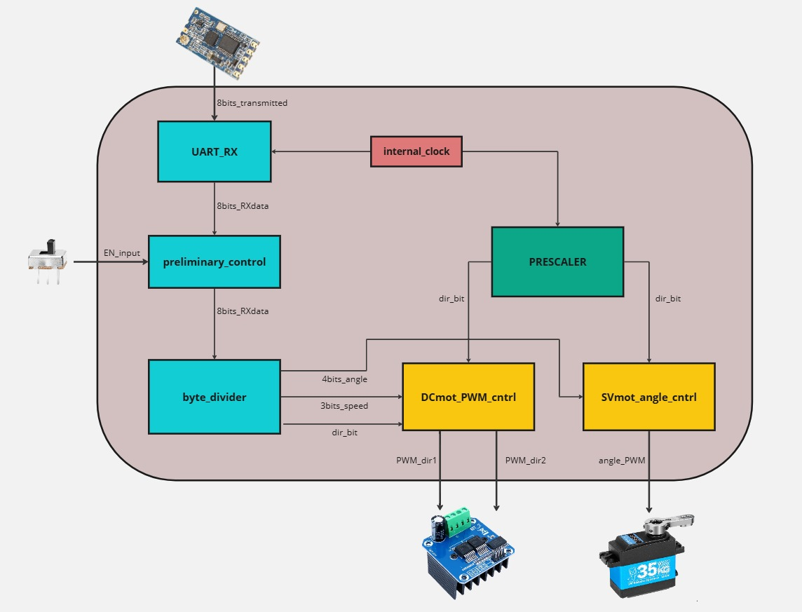
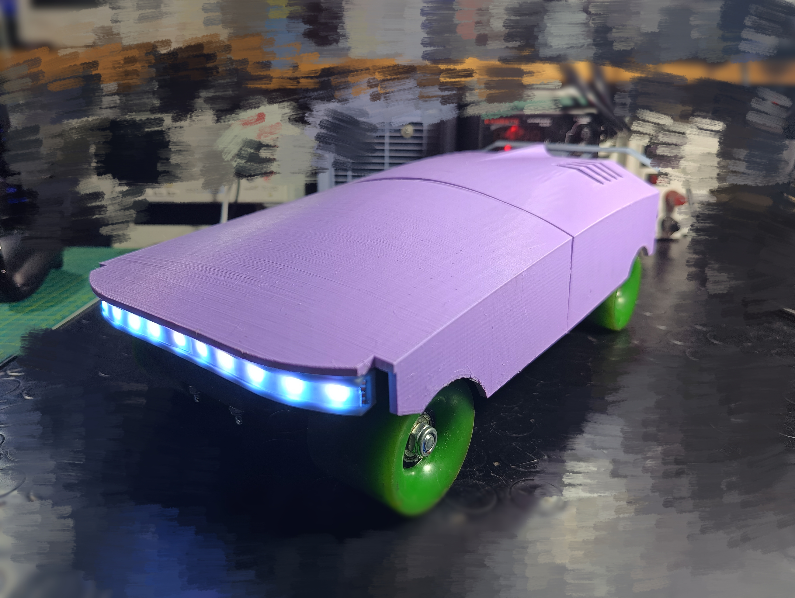

## FPGA & Project
FPGAs are known for their flexibility and ability to be reconfigured to perform any digital function, making them ideal for a wide range of applications in engineering.\\
The use of a Field Programmable Gate Array (FPGA) such as the MAX10Lite in our design offers a number of significant advantages. \\Historically, FPGAs were introduced in the 1980s as a solution to reduce the time and cost associated with designing custom integrated circuits. Since then, their popularity has grown tremendously, especially in signal processing, telecommunications, and, more recently, robotics engineering applications.\\\\

\noindent The project shown here aims to realize a radio-controlled vehicle driven through the DE10-Lite board.\\
\noindent The project wants to emphasize the board's ability to execute processes suitable for control in a parallel manner. Specifically, it is intended to design a vehicle with two steered wheels on the front axle and two driven wheels on the rear axle. \\

\noindent The expected difficulties are: 

\begin{itemize}
\item Selection of all physical components
\item Implementation of the radio module and its communication protocol
\item Processing of received and transmitted data
\item Realization of control signals 
\item Practical realization of the prototype.   
\end{itemize}

## Vehicle design
The project wants to emphasize the board’s ability to execute processes suitable for control in a parallel manner. Specifically, it is intended to design a vehicle with two steered wheels on the front axle and two driven wheels on the rear axle.

## Results
Final result of the asseblated prototype:

# Additional info
Check out the report if you are interested in our work!

[Link to PDF](Report.pdf)

## Note
You can also change the files in the components folder for your own purposes 

🚀 Happy coding! 🌟

